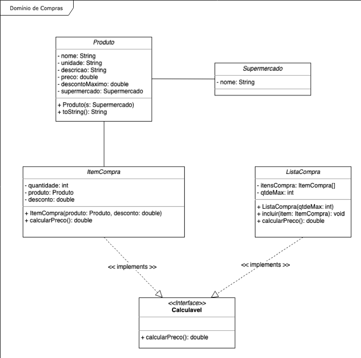

# Atividade Avaliativa Final
> jhonatan Oliveira Lopes

## exercício AreaChecker

Um professor de uma faculdade precisa desenvolver um aplicativo para conferência de cálculos simples. Para isso ele convocou um aluno da disciplina de LP II para desenvolver uma solução que possibilite ao mesmo efetuar algumas conferências, a citar:

Conferência do cálculo da área das seguintes figuras geométricas:

    Quadrado
    Retângulo
    Círculo
    Triângulo
    Paralelograma
    Trapézio
    Hexágono
    Losango
    Cubo


Tudo isso através de um ponto único.

O mesmo resolveu nomear este projeto de AreaChecker.

Precisamos ajudá-lo a desenvolver essa solução e para isso usaremos uma IDE de sua preferência e a plataforma Java.

Mãos à obra!


Obsevação:

Todas classes que representam os objetos deverão implementar a interface abaixo.

```java
public interface Calculable {
      double calcularArea();
}
```

A instanciação das diversas abstrações que concentrarão os cálculos específicos deverá ser feita através de uma implementação do pattern Abstract Factory (https://refactoring.guru/design-patterns/abstract-factory). Este será o ponto de partida!

O professor também precisa de uma classe de teste (usando ou não uma ferramenta/framework específico) com no mínimo um cenário de teste para cada cálculo de área implementada.

Foco da Atividade

    - Convencionamento de Código
    - Estruturação das Classes da Aplicação
    - Estruturação e Organização em Pacotes
    - Polimorfismo

## Como executar:

1. baixe e extraia o arquivo da pasta ```./project/exercicio_final.zip```
2. na raiz do projeto execute os comando em sequência:
    1. ```cd areachecker``` - para entrar nessa atividade
    1. ```mvn clean install``` - para instalar as dependências
    2. ```mvn exec:java``` - para executar o projeto
    3. ```mvn test``` - para executar a rotina de testes

## Exercício 2

Exercício 2 - Seu Astolfo recentemente adquiriu uma rede de supermercados e contratou a Você S.A., empresa especializada no desenvolvimento de soluções informatizadas, para implementar uma prova de conceito referente ao seu domínio de compras.

Para isso ele considerou as seguintes regras como sendo suas necessidades:

* package: edu.fatec.lp2.exercicio2 (organizar as classes e outros pacotes dentro deste)
* Deve haver uma abstração simplificada que represente seu Supermercado
* Deve haver uma abstração que represente seu produto, conforme diagrama abaixo
* A abstração produto terá seus próprios atributos e um único comportamento para retornar seu nome
* Deve haver uma abstração para representar os itens comprados pelo cliente
* Cada item de compra terá a quantidade adquirida e um desconto que pode variar de 0 ao descontoMaximo
* Deve haver a possibilidade de vincular ao item de compra o produto e o desconto
* Só será possível associar um único produto ao item de compra
* Deve haver uma ação no item de compra que possibilite calcular seu preço independente dos demais
* Deve haver uma abstração que represente a lista de compras e o mesmo deve possuir uma quantidade limite
* Deve haver uma ação na lista de compras que possibilite adicionar itens de compra até seu limite
* Deve haver uma ação na lista de compras que calcule o preço total da lista de compras
* As abstrações de item de compra e lista de compra deverão respeitar uma interface comum

Dadas as necessidades do Seu Astolfo e assumindo-se que todas as classes possuem métodos getter e setter (usar Lombok ou gerá-las através da IDE), vamos ajudar o Seu Astolfo a implementar as abstrações representadas no diagrama de classes abaixo e a lógica necessária para atender tais necessidades. Mãos à obra!

## Como executar:

1. baixe e extraia o arquivo da pasta ```./project/exercicio_final.zip```
2. na raiz do projeto execute os comando em sequência:
    1. ```cd exercicio2``` - para entrar nessa atividade
    1. ```mvn clean install``` - para instalar as dependências
    2. ```mvn exec:java``` - para executar o projeto

